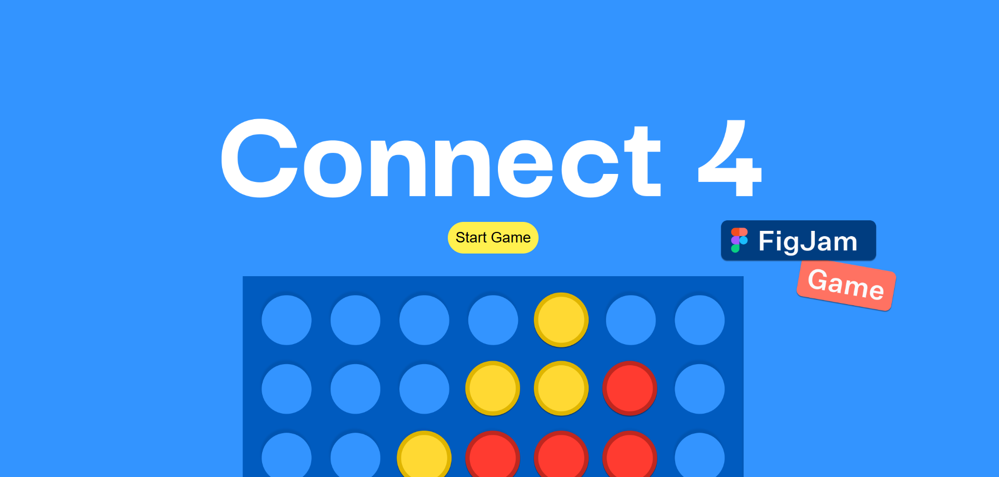
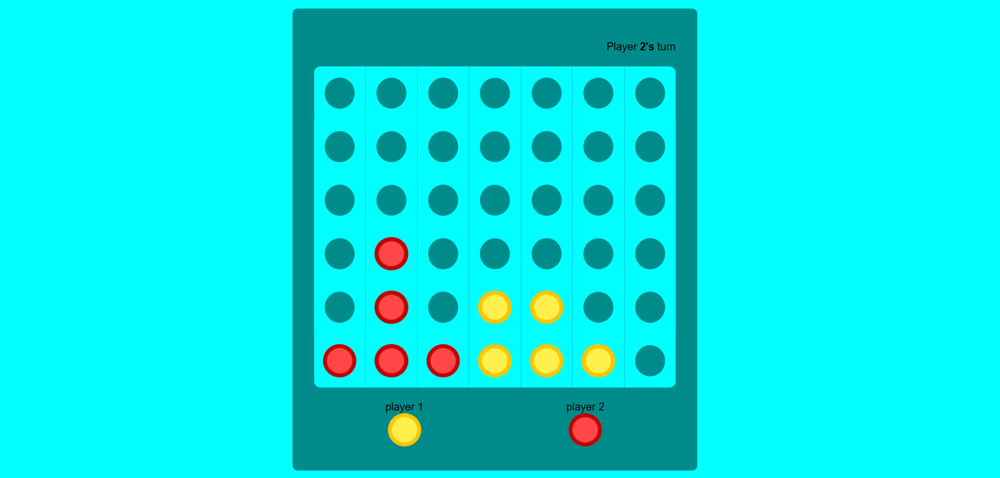
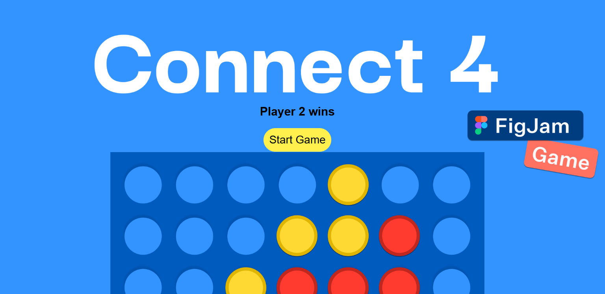

# 🎮 Connect 4 Game

[](https://RajalaxmiSarangi.github.io/Connect-4-Games/)

A simple **Connect 4** game built using **HTML**, **CSS**, and **JavaScript**.  
Play against a friend locally, drop your colored discs into the grid, and be the first to connect four in a row — horizontally, vertically, or diagonally.

---

## 📌 Features
- 🖱️ **Interactive Gameplay** – Click on a column to drop your disc.
- 🎨 **Color-coded Players** – Red vs Yellow (default colors).
- 📱 **Responsive Design** – Works on desktop and mobile browsers.
- 🔄 **Restart Button** – Start a new game without refreshing.
- 🏆 **Win Detection** – Automatically detects win or draw.
---

## 🕹️ How to Play
1. Player 1 starts with **Red** discs, Player 2 uses **Yellow** discs.
2. Players take turns clicking on the column where they want to drop their disc.
3. The first player to align **four discs** (horizontally, vertically, or diagonally) wins.
4. If the grid is full and no player has four in a row, the game ends in a draw.

---

## 📷 Screenshots

**Game Start**


**Mid Game**


**Winning Moment**


## Project Structure

```
├── index.html        # Main HTML file
├── style.css         # Styling for the game
├── script.js         # Main game logic (JavaScript)
└── assets/           # Images, icons, or fonts (if any)
```

## Technologies Used

- **JavaScript** – Game logic and interactivity
- **CSS** – Styling and responsive design
- **HTML** – Structure and layout

---

## 🚀 Getting Started

### 1️⃣ Clone the Repository
```bash
git clone https://github.com/RajalaxmiSarangi/Connect-4-Games.git
```

---

Enjoy playing Connect 4, and happy coding!  
*Made with ❤️ by [RajalaxmiSarangi](https://github.com/RajalaxmiSarangi)*
